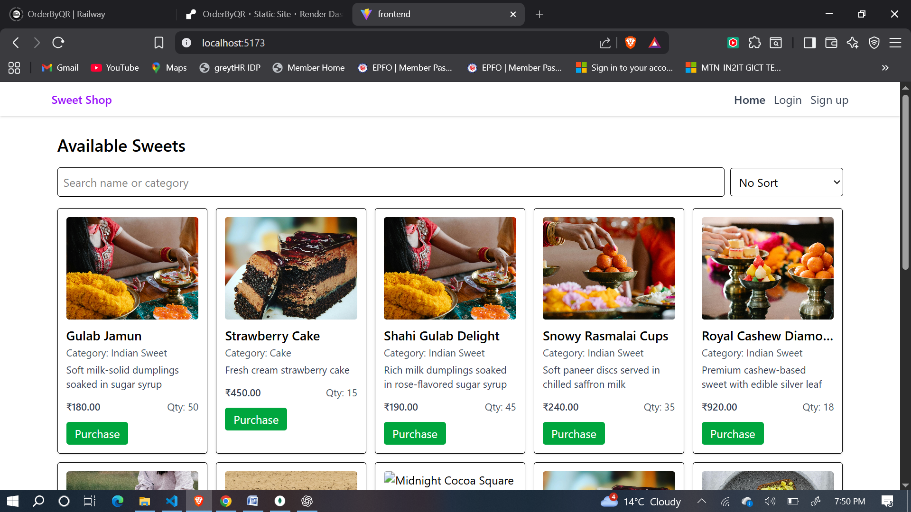
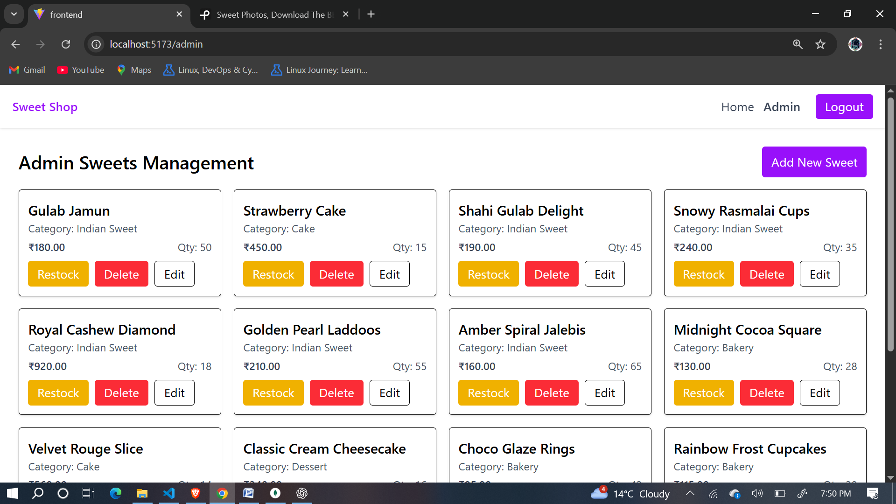
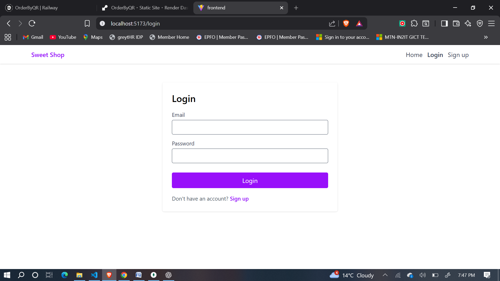
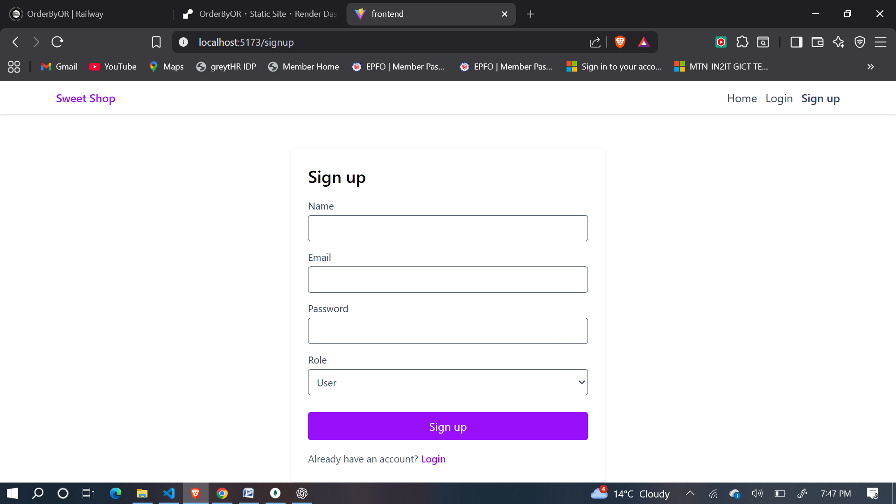
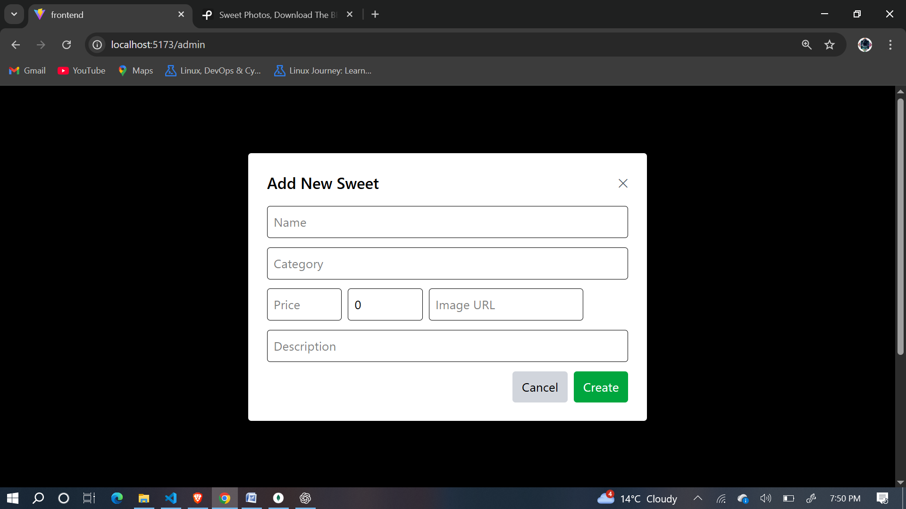

# Sweet Shop Management

A full-stack Sweet Shop Management application that allows users to browse and purchase sweets and enables admin to add, edit, delete, and restock sweets. The project includes: a Node/Express + MongoDB backend with JWT-based authentication, and a React + Vite frontend styled with Tailwind CSS.

## Features

- User registration and login with roles (user, admin)
- Role-based UI and protected backend routes
- Browse sweets catalog with single-field search (name/category) and price sorting
- Purchase sweets (decrements stock; disabled when quantity is 0)
- Admin CRUD: Create (modal), Read, Update, Delete, and Restock sweets
- Tailwind CSS for responsive UI

---

## Local Setup & Run Instructions

This project is split into two folders: `Backend` (API) and `Frontend` (React client). Follow the steps below to run both locally.

### Prerequisites

- Node.js (v18+ recommended)
- npm (bundled with Node.js)
- MongoDB instance (local or cloud — provide `MONGODB_URI` in backend env)

### Backend

1. Open terminal in this folder and change into backend directory:

```bash
cd Backend
```

2. Install dependencies:

```bash
npm install
```

3. Create a `.env` file in `Backend/` with the following environment variables (example):

```env
PORT=5000
MONGODB_URI=mongodb://localhost:27017/sweetshop
JWT_SECRET=your_jwt_secret_here
```
You can skip the .env file as i have also added these in code 

4. Start the backend server (development):

```bash
npm run dev
```
or
```bash
node server.js
```

The server will run at `http://localhost:5000` by default.

### Frontend

1. Open a new terminal and change into the frontend directory:

```bash
cd Frontend
```

2. Install dependencies:

```bash
npm install
```

3. If needed, create `.env` in `Frontend/` and set the backend URL you can also skip this too:

```env
VITE_BACKEND_URL=http://localhost:5000
```

4. Run the Vite dev server:

```bash
npm run dev
```

Open the app in your browser at the URL shown (typically `http://localhost:5173`).

---

## Screenshots

Example references in this README:

- Home / Sweets list



- Admin management



- Login



-Signup



-Add product



---

## Project Structure

- `Backend/` - Express API, routes, controllers, Mongoose models
- `Frontend/` - React, Tailwind CSS, components

Key files:

- `Backend/Controllers/userController.js` — auth endpoints (register/login)
- `Backend/Controllers/sweetsController.js` — sweets CRUD, search, purchase, restock
- `Backend/middleware/authMiddleware.js` — JWT protect and role checks
- `Frontend/src/components/sweets/` — `SweetsList`, `SweetCard`, `AdminSweets`
- `Frontend/src/utils/api.js` — fetch helpers and `parseJwt` utility

---

## My AI Usage

As part of development I leveraged AI tools to increase productivity and help with code generation and refactoring. Below is an honest summary of tool usage:

- Tools used:
  - ChatGPT (assistant): Used to plan changes, generate code snippets, create the README content, and discuss best practices for role-based auth and search behavior.
  
  -ChatGPT (for backend): used to generate search api then i added some logic manually also used to generate authMiddleware then modified manually

  -ChatGPT (for Frontend): used to generate templates of sweetCard and sweetList then modified manually also created api.js in utils then add manually i have done css using tailwind by the help of chatgpt to save time 

- How I used them:
  - **Code Generation**: Used  ChatGPT suggestions to scaffold `SweetsList`, `SweetCard`, `AdminSweets` components and adjust backend controllers and middleware.

- Reflection on impact:
  - AI helped accelerate implementation by providing quick code examples and catching small mistakes. I validated all AI-generated code manually and adapted it to project-specific constraints.

---

## Live Link
You can click this link to check it just create new account to purchase of choose role admin to handle it i have deployed it on render 
- **Link**: https://sweet-shop-management-system-1-19lc.onrender.com